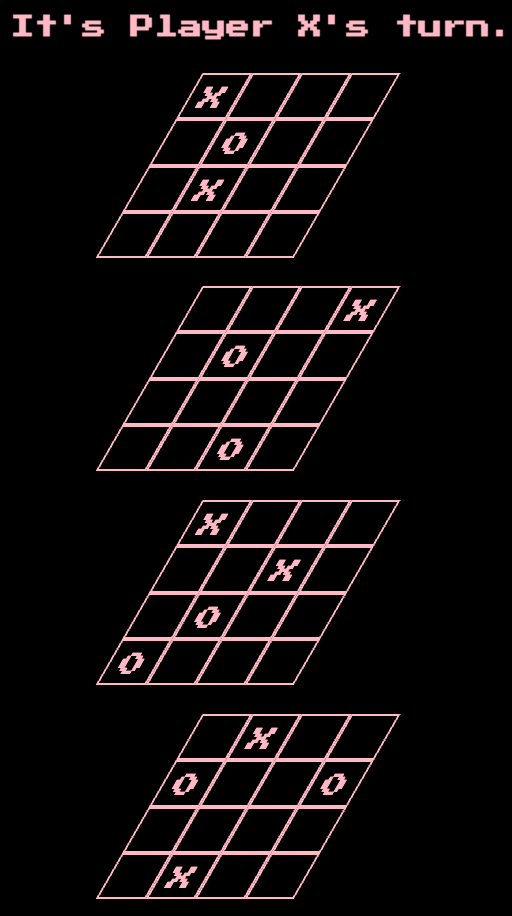
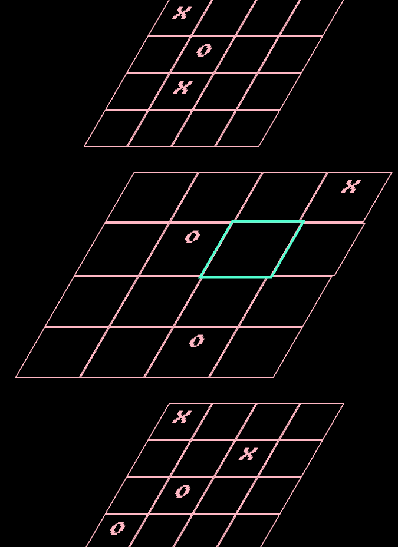

# Welcome to Qubic!
## Screenshots
1. 
2. 

## The Game
Qubic or 3d tic-tac-toe is similar to the standard two dimensional version. Players take turns placing their game pieces and must prevent the other player from completing a complete line. In 3d however the game expands to 4x4x4 and you have to get four in a row to win. That can be all on one level up/down, left/right or diagonal OR it can be across all four levels with one piece on each level sequentially.

I chose this game after building tic tac toe around the same time as learning more about CSS animations. Immediately seeing the possibilities for 3d effects with transformations like skew and scale it seemed like too much fun to not build- not to mention the layup opportunity to use synthwave styling for 80s style neon 3d grids.

## Getting Started
If you want to dive right in you can [play here.](https://zbrustkern.github.io/qubic/)
The original wireframes of the planning process can be found [here](./assets/qubic%20grid.jpg), [here](./assets/Intro%20Modal.jpg), [and here.](./assets/stats%20page.jpg)

## Attributions
1. [Google Fonts](https://fonts.google.com/) for the in game typography.
2. [Google Gemini](https://gemini.google.com/) helped with the concept art.

## Technologies Used
This game is pretty simple- the entire thing is written in:
, , and .

## Next Steps
Continued rendering enhancements across devices:
1. Mobile improvements- make the effects less reliant on a cursor.
2. Make it easier to play with a touch screen.
3. Add the ability to play across devices.
4. Add a leaderboard.
